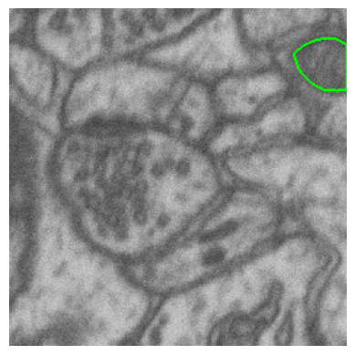

# yolo_v8_segmentation

<!-- WARNING: THIS FILE WAS AUTOGENERATED! DO NOT EDIT! -->

This file will become your README and also the index of your
documentation.

## Install

``` sh
pip install yolo_v8_segmentation
```

## How to use

### Visualize mask and image

``` python
from yolo_v8_segmentation.viz_utils import *
```

``` python
msk_path = Path(r'/home/hasan/Schreibtisch/projects/data/microscopy/patch_train_masks')
img_path = Path(r'/home/hasan/Schreibtisch/projects/data/microscopy/patch_train_images/')
```

``` python
idx = 2
image = img_path.ls()[idx]
msk = msk_path.ls()[idx]
```

------------------------------------------------------------------------

<a
href="https://github.com/HasanGoni/yolo_v8_segmentation/blob/main/yolo_v8_segmentation/viz_utils.py#LNone"
target="_blank" style="float:right; font-size:smaller">source</a>

### overlay_mask_border_on_image

>      overlay_mask_border_on_image (im_path, msk_path, border_color=(0, 1, 0),
>                                    border_width=1)

Overlays the border of a binary mask on a grayscale image and displays
the result using matplotlib.

Args: image (numpy.ndarray): Grayscale image. mask (numpy.ndarray):
Binary mask of the same size as the image. border_color (tuple): RGB
color for the mask border in the range \[0, 1\]. border_width (int):
Width of the border.

Returns: None: The function displays a plot.

``` python
overlay_mask_border_on_image(im_path=image, msk_path=msk)
```



``` python
overlay_mask(im_path=image, msk_path=msk)
```


